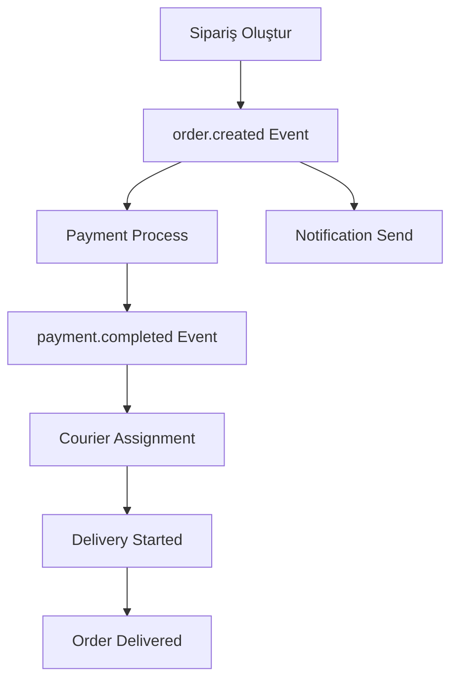

# Online Order Microservices

Bu proje, online yemek sipariş sistemi için geliştirilmiş bir mikroservis mimarisidir. Spring Boot ve Spring Cloud teknolojileri kullanılarak geliştirilmiştir.

> ⚠️ **Not**: Bu proje eğitim amaçlıdır. Gerçek ödeme ve bildirim entegrasyonları yerine mock implementasyonlar kullanılmıştır.

## 🏗️ Mimari

Bu sistem 8 ana mikroservisten oluşmaktadır:

### Infrastructure Services
- **Config Server**: Merkezi konfigürasyon yönetimi
- **Eureka Server**: Service discovery ve registry
- **API Gateway**: Dış dünyaya açılan  giriş noktası

### Business Services
- **User Service**: Kullanıcı yönetimi
- **Restaurant Service**: Restoran ve menü yönetimi
- **Order Service**: Sipariş yönetimi ve orkestrasyon
- **Payment Service**: Ödeme işlemleri (Mock)
- **Courier Service**: Kurye ve teslimat yönetimi
- **Notification Service**: Bildirim sistemi (Mock)

### Shared Module
- **Common**: Ortak kütüphaneler, RabbitMQ konfigürasyonu ve mesajlaşma altyapısı

## 🛠️ Teknoloji Stack

- **Java 17**
- **Spring Boot 3.5.5**
- **Spring Cloud 2025.0.0**
- **PostgreSQL 16** (Veritabanı)
- **RabbitMQ** (Asenkron mesajlaşma)
- **Maven** (Dependency management)
- **MapStruct** (Entity-DTO mapping)
- **Lombok** (Boilerplate kod azaltma)
- **OpenAPI/Swagger** (API dokümantasyonu)
- **Flyway** (Veritabanı migration)

## 🎯 Örnek Kullanım Senaryosu

### Tipik Sipariş Akışı:
1. **Kullanıcı Kaydı**: Kullanıcı sisteme kayıt olur → User Service
2. **Restoran Seçimi**: Kullanıcı mevcut restoranları görüntüler → Restaurant Service
3. **Menü İnceleme**: Seçilen restoranın menü öğelerini inceler → Restaurant Service
4. **Sipariş Oluşturma**: Kullanıcı sepetini oluşturur ve siparişi verir → Order Service
5. **Ödeme İşlemi**: Mock ödeme işlemi gerçekleşir → Payment Service
6. **Kurye Ataması**: - Ödeme başarılı olduğunda otomatik teslimat kaydı oluşturulur.⚠️ **Manuel kurye ataması gereklidir** (API çağrısı ile). Kurye seçimi henüz otomatik değildir → Courier Service
7. **Bildirimler**: Kullanıcıya sipariş durumu ile ilgili bildirimler gönderilir → Notification Service

### Event-Driven İletişim:
```
Order Created → Payment Process → Manual Courier Assignment → User Notification
      ↓              ↓                ↓                    ↓
 [RabbitMQ]    [RabbitMQ]       [REST API Call]         [RabbitMQ]
```

## 📋 Servis Detayları

### User Service
- **Port**: 8081
- **Database**: PostgreSQL
- **Fonksiyonlar**:
  - Kullanıcı kayıt/giriş
  - Kullanıcı profil yönetimi
  - CRUD operasyonları
  - Sayfalama desteği

### Restaurant Service  
- **Port**: 8082
- **Database**: PostgreSQL
- **Fonksiyonlar**:
  - Restoran yönetimi
  - Menü yönetimi
  - Menü öğelerinin kullanılabilirlik kontrolü
  - Restoran-menü ilişki yönetimi

### Order Service
- **Port**: 8083
- **Database**: PostgreSQL
- **Fonksiyonlar**:
  - Sipariş oluşturma ve yönetimi
  - Sipariş durumu takibi (PENDING, CONFIRMED, DELIVERED, CANCELLED)
  - Diğer servislerle koordinasyon (User, Restaurant, Payment, Courier)
  - RabbitMQ ile event publishing
  - Otomatik toplam fiyat hesaplama

### Payment Service (Mock)
- **Port**: 8084
- **Database**: PostgreSQL
- **Fonksiyonlar**:
  - Mock ödeme işlemleri
  - Ödeme durumu yönetimi
  - Sipariş-ödeme ilişkilendirmesi
  - **Not**: Gerçek ödeme gateway entegrasyonu yok

### Courier Service
- **Port**: 8085
- **Database**: PostgreSQL
- **Fonksiyonlar**:
  - Kurye yönetimi (aktif/pasif durum)
  - Teslimat takibi ve durum yönetimi
  - Konum bilgisi yönetimi (lat/lng)
  - Araç türü bilgisi
   - **Kurye Ataması**: 
    - ✅ Ödeme başarılı olduğunda otomatik teslimat kaydı oluşturma (RabbitMQ event listener)
    - ⚠️ **Manuel kurye ataması** (REST API ile courierId belirtilerek)
    - ❌ Otomatik kurye seçimi algoritması mevcut değil

### Notification Service (Mock)
- **Port**: 8086
- **Fonksiyonlar**:
  - RabbitMQ consumer
  - Mock bildirim gönderimi (email, SMS simülasyonu)
  - Event-driven notification
  - **Not**: Gerçek email/SMS entegrasyonu yok

### API Gateway
- **Port**: 8080
- **Fonksiyonlar**:
  - Request routing tüm servislere
  - Load balancing
  - Merkezi giriş noktası

### Config Server (Git Entegrasyonlu)
- **Port**: 8888
- **Git Repository**: `https://github.com/username/project-name-config.git`
- **Fonksiyonlar**:
  - **Merkezi Konfigürasyon**: Tüm servislerin ayarları Git'te
  - **Dynamic Refresh**: Runtime'da config değişiklikleri
  - **Security**: Git credentials ile güvenli erişim

### Eureka Server
- **Port**: 8761
- **Fonksiyonlar**:
  - Service discovery
  - Service registry
  - Health monitoring

## 🚀 Kurulum ve Çalıştırma

### Ön Gereksinimler
- Java 17+
- Maven 3.6+
- Docker & Docker Compose
- **Git Credentials**: Config Server için GitHub erişimi

### 0. Environment Variables (Config Server için)
```bash
# Config Server için Git credentials
export GIT_USERNAME=your-github-username
export GIT_PASSWORD=your-github-token

# Windows için:
set GIT_USERNAME=your-github-username
set GIT_PASSWORD=your-github-token
```

### 1. External Dependencies
```bash
# PostgreSQL ve RabbitMQ'yu başlat
docker-compose up -d

# Servislerin hazır olduğunu kontrol et
# PostgreSQL: http://localhost:5051 (Adminer)
# RabbitMQ: http://localhost:15672 (guest/guest)
```

### 2. Servisleri Sırayla Başlatma
```bash
# 1. Config Server (Önce bu başlamalı - Git'ten config'leri çeker)
cd config-server && mvn spring-boot:run

# 2. Eureka Server (Config Server'dan sonra)
cd eureka-server && mvn spring-boot:run

# 3. Business Services (paralel olarak başlatılabilir)
cd user-service && mvn spring-boot:run &
cd restaurant-service && mvn spring-boot:run &
cd payment-service && mvn spring-boot:run &
cd courier-service && mvn spring-boot:run &
cd notification-service && mvn spring-boot:run &
cd order-service && mvn spring-boot:run &

# 4. API Gateway (Son olarak)
cd api-gateway && mvn spring-boot:run
```

## 🌐 Port Bilgileri

| Servis | Port | Health Check | Swagger UI |
|--------|------|-------------|------------|
| API Gateway | 8080 | `/actuator/health` | `/swagger-ui.html` |
| User Service | 8081 | `/actuator/health` | `/swagger-ui.html` |
| Restaurant Service | 8082 | `/actuator/health` | `/swagger-ui.html` |
| Order Service | 8083 | `/actuator/health` | `/swagger-ui.html` |
| Payment Service | 8084 | `/actuator/health` | `/swagger-ui.html` |
| Courier Service | 8085 | `/actuator/health` | `/swagger-ui.html` |
| Notification Service | 8086 | `/actuator/health` | `/swagger-ui.html` |
| Eureka Server | 8761 | `/` | - |
| Config Server | 8888 | `/actuator/health` | - |
| PostgreSQL | 5432 | - | - |
| Adminer | 5051 | `/` | - |
| RabbitMQ Management | 15672 | `/` | - |

## 📡 API Endpoints

### User Service (`/api/users`)
```bash
# Kullanıcı listesi (paginated)
GET /api/users?page=0&size=20&sort=id,desc

# Kullanıcı detayı
GET /api/users/{id}

# Yeni kullanıcı oluştur
POST /api/users
{
  "email": "john@example.com",
  "password": "password123",
  "fullName": "John Doe"
}
```

### Restaurant Service (`/api/restaurants`)
```bash
# Restoran listesi
GET /api/restaurants?page=0&size=20

# Menü öğesi detayı
GET /api/restaurants/{restaurantId}/menu-items/{menuItemId}
```

### Order Service (`/api/orders`)
```bash
# Yeni sipariş oluştur
POST /api/orders
{
  "userId": 1,
  "restaurantId": 1,
  "deliveryAddress": "123 Main St",
  "orderItems": [
    {
      "menuItemId": 1,
      "quantity": 2
    }
  ]
}
```

## 📊 Data Models

### User
```json
{
  "id": 1,
  "email": "user@example.com",
  "fullName": "John Doe",
  "createdAt": "2024-01-01T10:00:00",
  "updatedAt": "2024-01-01T10:00:00"
}
```

### Restaurant
```json
{
  "id": 1,
  "name": "Pizza Palace",
  "address": "123 Main St",
  "phone": "+1234567890",
  "menuItems": [
    {
      "id": 1,
      "name": "Margherita Pizza",
      "description": "Classic pizza with tomato and mozzarella",
      "price": 12.75,
      "available": true
    }
  ]
}
```

### Order
```json
{
  "id": 1,
  "userId": 1,
  "restaurantId": 1,
  "deliveryAddress": "456 Oak St",
  "totalPrice": 25.50,
  "status": "PENDING",
  "orderItems": [
    {
      "menuItemId": 1,
      "menuItemName": "Margherita Pizza",
      "quantity": 2,
      "unitPrice": 12.75,
      "totalItemPrice": 25.50
    }
  ],
  "createdAt": "2024-01-01T10:00:00"
}
```

### Courier
```json
{
  "id": 1,
  "fullName": "Jane Driver",
  "phone": "+1234567890",
  "vehicleType": "Motorcycle",
  "active": true,
  "currentLat": 40.7128,
  "currentLng": -74.0060
}
```

## 🔄 Message Flow & Events

### RabbitMQ Exchange Yapısı:
```
order.exchange
├── order.created 
├── order.confirmed
├── order.cancelled
└── order.delivered

notification.exchange
├── user.notification
└── order.status.changed

payment.exchange
├── payment.process
└── payment.completed
```

### Sipariş Yaşam Döngüsü:


## 🧪 Test Senaryoları

### Config Server Test:

1. **Config Server Çalışma Kontrolü**:
   - Tarayıcıda: http://localhost:8888/user-service/default
   - Bu URL servisin konfigürasyonunu gösterecek

2. **Environment-based Config Test**:
   http://localhost:8888/user-service/default
  

3. **Git Repository Değişiklik Testi**:
   - GitHub'da config dosyasında değişiklik yap
   - Servis restart'ı ile yeni config'in geldiğini kontrol et

### API Test (Swagger UI ile):
Her servisin Swagger UI'ını kullanarak test edebilirsiniz:
- User Service: http://localhost:8081/swagger-ui.html
- Restaurant Service: http://localhost:8082/swagger-ui.html  
- Order Service: http://localhost:8083/swagger-ui.html
- Payment Service: http://localhost:8084/swagger-ui.html
- Courier Service: http://localhost:8085/swagger-ui.html

### RabbitMQ Event Monitoring:
- RabbitMQ Management: http://localhost:15672 (guest/guest)
- Queues sekmesinde mesajları kontrol edin
- Exchanges'te event'lerin gönderildiğini izleyin

## 🐳 Docker Support

### Infrastructure Services:
```bash
# Altyapı servislerini başlat
docker-compose up -d

# Logları izle
docker-compose logs -f

# Servisleri durdur
docker-compose down
```

### Database Bağlantı Bilgileri:
- **Host**: localhost:5432
- **Database**: postgres
- **Username**: user
- **Password**: password

## 🔧 Configuration Management (Git Entegrasyonlu)

### Config Server Git Integration:
Proje merkezi konfigürasyon için ayrı bir Git repository kullanır:
- **Repository**: `https://github.com/username/project-name-config.git`
- **Structure**: Her servis için ayrı YAML dosyası
- **Environment Support**: `service-name-{env}.yml` formatı

### Git Repository Yapısı:
```
online-order-microservices-config/
├── user-service.yml          # Default config
├── order-service.yml
├── restaurant-service.yml
├── payment-service.yml
├── courier-service.yml
├── notification-service.yml
└── api-gateway.yml
```

### Service Config Connection:
```yaml
# Her servisin application.yml dosyasında
spring:
  application:
    name: user-service  # Git'te user-service.yml dosyasını arar
  config:
    import: "configserver:http://localhost:8888"
```

### Environment Variables:
```bash
# Config Server için gerekli
export GIT_USERNAME=your-github-username
export GIT_PASSWORD=your-personal-access-token
```

## 📚 API Documentation

Swagger UI her serviste mevcut:
- Order Service: http://localhost:8083/swagger-ui.html
- User Service: http://localhost:8081/swagger-ui.html
- Restaurant Service: http://localhost:8082/swagger-ui.html
- Payment Service: http://localhost:8084/swagger-ui.html
- Courier Service: http://localhost:8085/swagger-ui.html

## 🚨 Troubleshooting

### Yaygın Sorunlar:

1. **Servis başlamıyor**:
   - Config Server'ın çalıştığından emin ol
   - Git credentials'ın doğru olduğunu kontrol et
   - Port çakışması kontrolü yap
   - PostgreSQL bağlantısını kontrol et

2. **Config Server bağlantı hatası**:
   - GitHub credentials kontrolü
   - Repository erişim izinleri
   - Network bağlantısı

3. **RabbitMQ bağlantı hatası**:
   - Docker container'ın çalıştığından emin ol
   - Port 5672'nin açık olduğunu kontrol et

4. **Database hatası**:
   - PostgreSQL container'ın hazır olduğunu bekle
   - Flyway migration'ların başarılı olduğunu kontrol et

    
## 🔮 Gelecek Geliştirmeler

- [ ] Authentication & Authorization (JWT)
- [ ] Caching layer (Redis)
- [ ] Monitoring (Prometheus, Grafana)
- [ ] API Rate Limiting
- [ ] Distributed Tracing (Zipkin)


> 💡 **İpucu**: Servisleri ilk defa çalıştırırken 2-3 dakika bekleyin. Veritabanı migration'ları ve service discovery registration'ı biraz zaman alabilir.